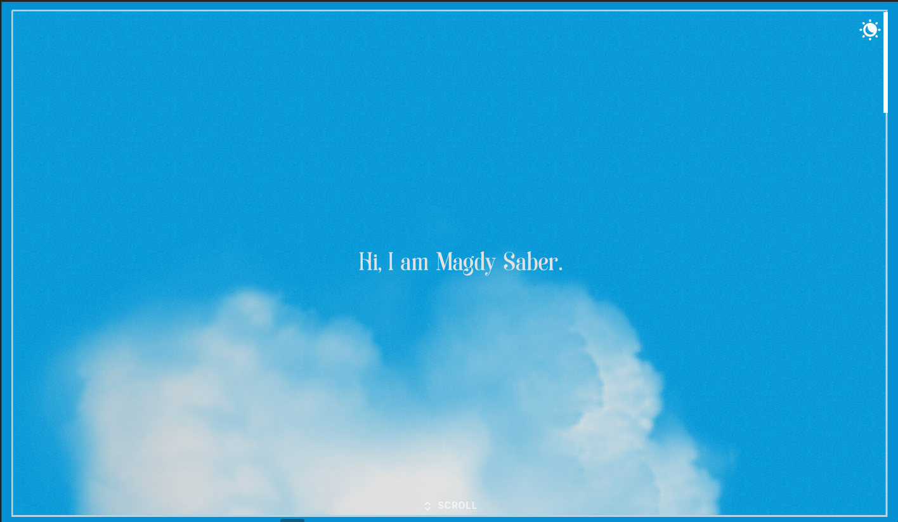
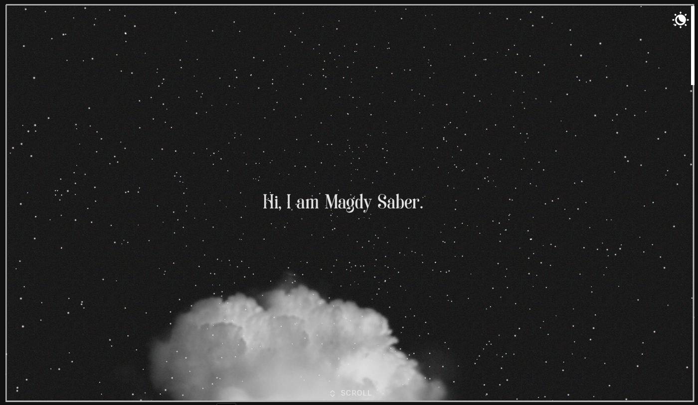
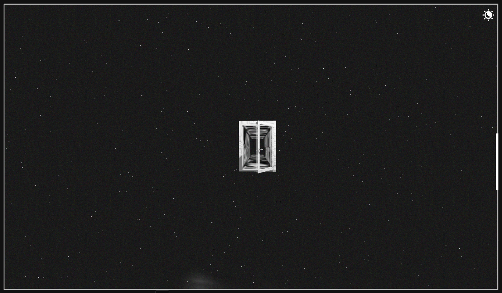
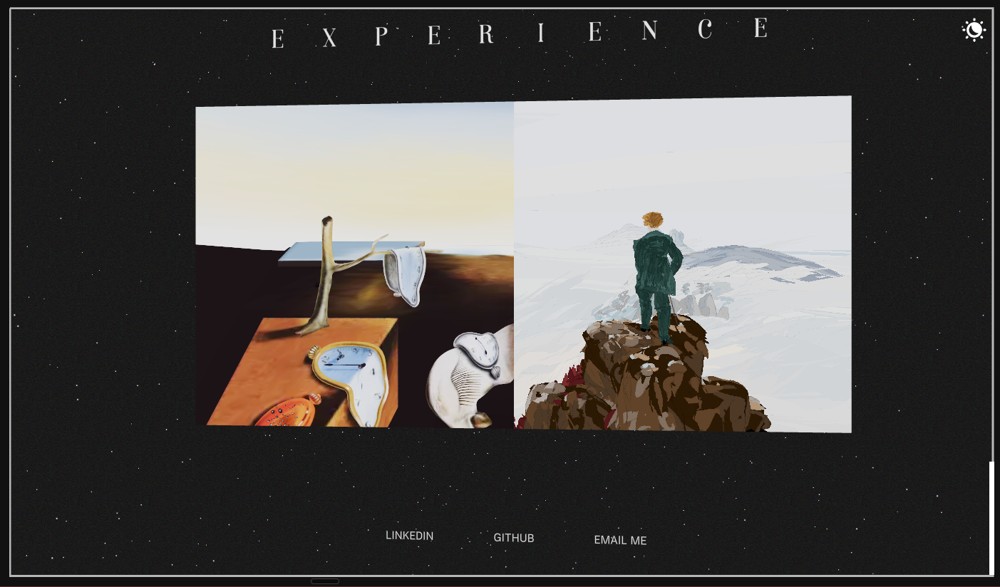

# Magdy Saber — 3D Portfolio

A fully interactive 3D portfolio built with React, Three.js, and GSAP. Scroll through a living scene, switch between day and night, and step through portal tiles into the Experience section.

> Inspired by the work of Mohit.

---

## Screenshots

### Hero — Light Mode


### Hero — Dark Mode


### Scroll Transition


### Experience Section


---

## Tech Stack

| Layer | Library |
|---|---|
| 3D rendering | [React Three Fiber](https://docs.pmnd.rs/react-three-fiber) + [Three.js](https://threejs.org) |
| 3D helpers | [@react-three/drei](https://github.com/pmndrs/drei) |
| Animation | [GSAP](https://gsap.com) |
| State | [Zustand](https://zustand-demo.pmnd.rs) |
| Styling | [Tailwind CSS](https://tailwindcss.com) |
| Build | [Vite](https://vitejs.dev) |

---

## Features

- **Day / Night theme** — toggle between a blue-sky day scene and a starfield night scene
- **Scroll-driven camera** — GSAP + R3F animate the camera through each section as you scroll
- **Portal tiles** — MeshPortalMaterial tiles in the Experience section open into dedicated 3D worlds for Side Projects and Work & Education
- **Responsive** — mobile-optimised layouts with static tile thumbnails and a dedicated project overlay

---

## Getting Started

```bash
pnpm install
pnpm --filter @workspace/portfolio run dev
```

---

## License

MIT
